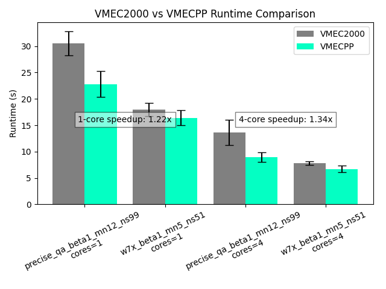

# VMEC++ benchmarks



## Running the benchmarks

### Set up the Python virtual environment

```shell
python3 -m venv venv
source venv/bin/activate

# Base dependencies
pip install simsopt vmecpp matplotlib pandas mpi4py

# On Ubuntu 22.04: we offer a pre-built VMEC2000 for comfort
pip install vmec@https://anaconda.org/eguiraud-pf/vmec/0.0.6/download/vmec-0.0.6-cp310-cp310-linux_x86_64.whl

# On other platforms: you need to install https://github.com/hiddenSymmetries/VMEC2000 from source
```

### Run the benchmarks

```shell
source venv/bin/activate

# Run benchmarks, store full logs
bash bench.sh 2>&1 | tee logs.txt

# Extract runtimes and make comparison plot
egrep 'VMEC(PP|2000)' < logs.txt > runtimes.txt

# Plot results: this produces 'benchmark.png'
python comparison_plot.py runtimes.txt
```
